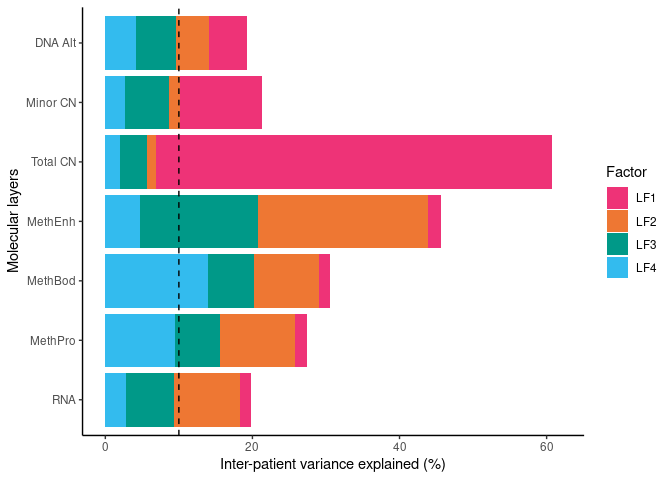
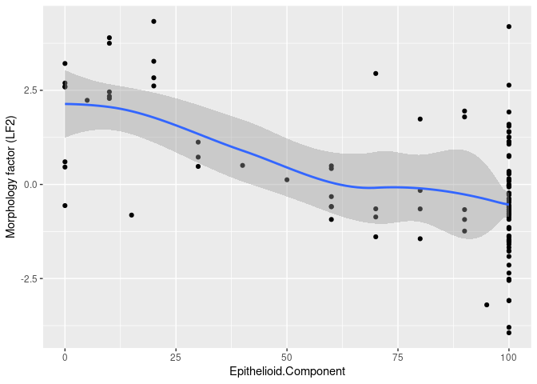
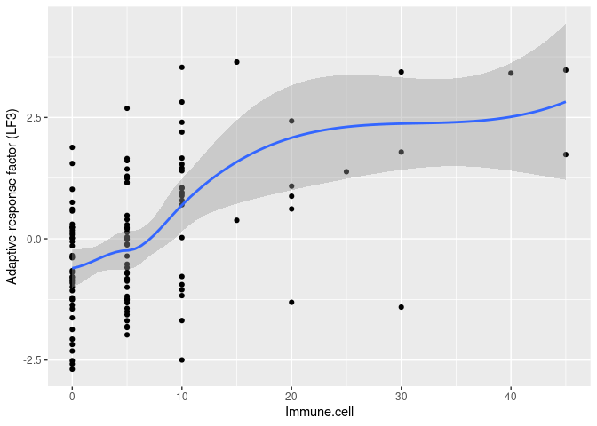
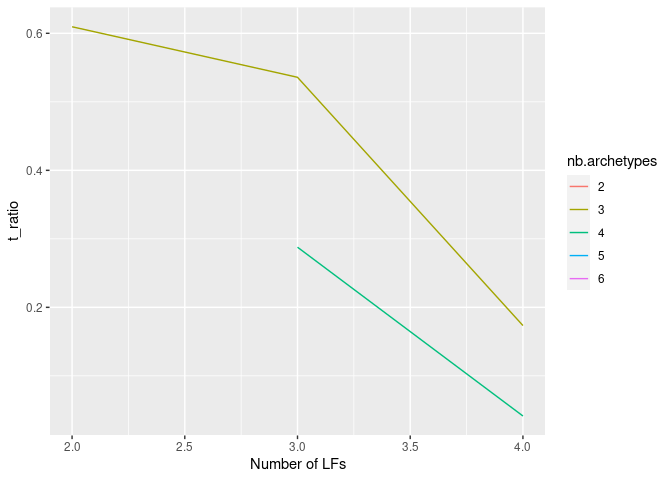
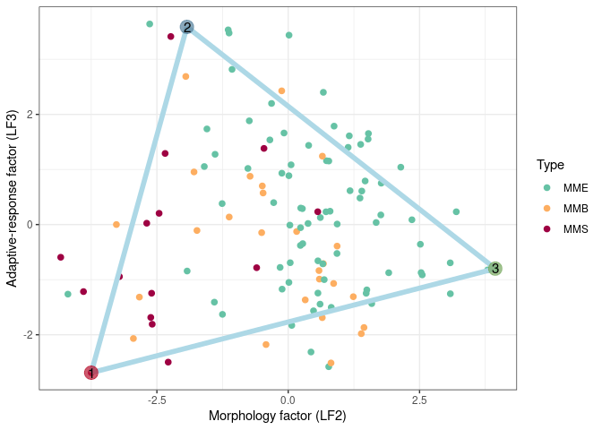
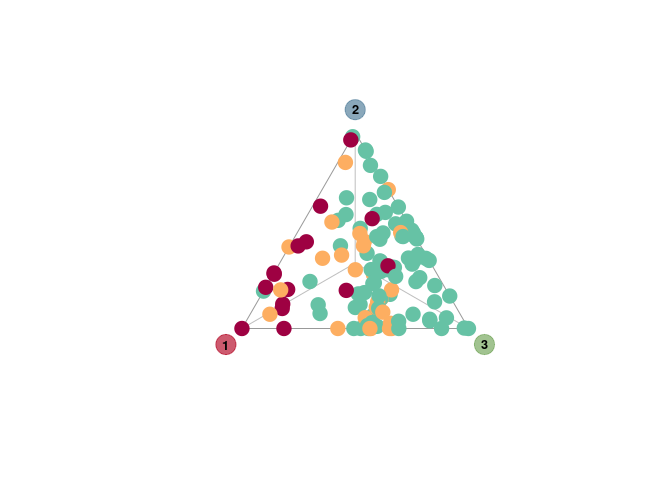

# Load libraries

```r
library(tidyverse)
```

```
## ── Attaching packages ─────────────────────────────────────── tidyverse 1.3.1 ──
```

```
## ✔ ggplot2 3.3.6      ✔ purrr   0.3.4 
## ✔ tibble  3.1.8      ✔ dplyr   1.0.10
## ✔ tidyr   1.2.1      ✔ stringr 1.5.0 
## ✔ readr   2.1.3      ✔ forcats 0.5.1
```

```
## ── Conflicts ────────────────────────────────────────── tidyverse_conflicts() ──
## ✖ dplyr::filter() masks stats::filter()
## ✖ dplyr::lag()    masks stats::lag()
```

```r
require(tibble)
library(ggpubr)
library(MOFA2)
```

```
## 
## Attaching package: 'MOFA2'
```

```
## The following object is masked from 'package:stats':
## 
##     predict
```

```r
library(reticulate)
library(DescTools)
library(ParetoTI)
```

```
## Loading required package: data.table
```

```
## 
## Attaching package: 'data.table'
```

```
## The following object is masked from 'package:DescTools':
## 
##     %like%
```

```
## The following objects are masked from 'package:dplyr':
## 
##     between, first, last
```

```
## The following object is masked from 'package:purrr':
## 
##     transpose
```

```
## Loading required package: lpSolve
```

```
## Warning: replacing previous import 'ggplot2::last_plot' by 'plotly::last_plot'
## when loading 'ParetoTI'
```

```r
library(readxl)
library(Ternary)
```

See MOFA (https://biofam.github.io/MOFA2/installation.html) and ParetoTI installation instructions (https://github.com/vitkl/ParetoTI). In case of trouble in linking R and python, use the reticulate package to specify the correct python install (e.g., if you have installed all mofa dependencies into a conda environment, use reticulate::use_condaenv("~/miniconda3/envs/mofa2/")). 

# load input matrices
These were generated by the preprocessing script Preprocessing_MESOMICS.R from the raw data, also included in this repo in the folder at "MESOMICS_data/phenotypic_map/MESOMICS/". Assuming that this script is run from this folder, we load the matrices

```r
load("D_exprB_MOFA.RData")
load("D_met.proB_MOFA.RData")
load("D_met.bodB_MOFA.RData")
load("D_met.enhB_MOFA.RData")
load("D_cnv_MOFA.RData")
load("D_loh_MOFA.RData")
load("D_alt_MOFA.RData")
```

# Multi-Omic Factor Analysis
## Prepare MOFA
We create the MOFA object, set training and model options and prepare the object

```r
MOFAobject = create_mofa(list("RNA" = D_exprB_MOFA,"MethPro" = D_met.proB_MOFA,"MethBod" = D_met.bodB_MOFA,"MethEnh" = D_met.enhB_MOFA,
                              "Total" = D_cnv_MOFA, "Minor" = D_loh_MOFA, "Alt" = D_alt_MOFA))
```

```
## Creating MOFA object from a list of matrices (features as rows, sample as columns)...
```

```
## Warning in .rename_duplicated_features(object): There are duplicated features names across different views. We will add the suffix *_view* only for those features 
##             Example: if you have both TP53 in mRNA and mutation data it will be renamed to TP53_mRNA, TP53_mutation
```

```r
data_opts = get_default_data_options(MOFAobject)
model_opts = get_default_model_options(MOFAobject)
model_opts$num_factors = 10
model_opts$likelihoods["Alt"] = "bernoulli"
train_opts = get_default_training_options(MOFAobject)
train_opts$convergence_mode = "slow"
train_opts$maxiter = 10000

MOFAobject = prepare_mofa(object=MOFAobject, data_options=data_opts, model_options=model_opts, training_options=train_opts )
```

```
## Checking data options...
```

```
## Checking training options...
```

```
## Checking model options...
```

## Run MOFA

```r
MOFAobject.trained = run_mofa(MOFAobject, save_data = T, outfile = "MOFAobject.hdf5",use_basilisk = F)
```

```
## Warning: Output file MOFAobject.hdf5 already exists, it will be replaced
```

```
## Connecting to the mofapy2 python package using reticulate (use_basilisk = FALSE)... 
##     Please make sure to manually specify the right python binary when loading R with reticulate::use_python(..., force=TRUE) or the right conda environment with reticulate::use_condaenv(..., force=TRUE)
##     If you prefer to let us automatically install a conda environment with 'mofapy2' installed using the 'basilisk' package, please use the argument 'use_basilisk = TRUE'
```

## Extract Latent factor coordinates of samples from MOFA object

```r
LFs = as.data.frame(get_factors(MOFAobject.trained)$group1)
```

## Compute variance explained and order factors based on total R2
For each of the 7 molecular layers, the total R2 is the average squared Pearson correlation coefficient. For DNA alterations, because it is a binary variable, we also compute the pseudo R2 using the Veall Zimmermann estimator.

```r
R2_expr    = colMeans(t(cor(LFs,t(D_exprB_MOFA),use="pairwise.complete.obs") )**2,na.rm=T)
R2_met.bod = colMeans(t(cor(LFs,t(D_met.bodB_MOFA),use="pairwise.complete.obs") )**2,na.rm=T)
R2_met.pro = colMeans(t(cor(LFs,t(D_met.proB_MOFA),use="pairwise.complete.obs") )**2,na.rm=T)
R2_met.enh = colMeans(t(cor(LFs,t(D_met.enhB_MOFA),use="pairwise.complete.obs") )**2,na.rm=T)
R2_CNV     = colMeans(t(cor(LFs,t(D_cnv_MOFA),use="pairwise.complete.obs") )**2,na.rm=T)
R2_loh     = colMeans(t(cor(LFs,t(D_loh_MOFA),use="pairwise.complete.obs") )**2,na.rm=T)
R2_alt     = colMeans(t(cor(LFs,t(D_alt_MOFA),use="pairwise.complete.obs") )**2,na.rm=T)
R2_alt.logistic = sapply(1:10, function(k) mean(sapply(1:nrow(D_alt_MOFA), function(i) PseudoR2(glm( D_alt_MOFA[i,]~ LFs[,k],family = "binomial"),which = "VeallZimmermann")),na.rm=T ) )
```

```
## Warning: glm.fit: fitted probabilities numerically 0 or 1 occurred
```

```
## Warning: glm.fit: algorithm did not converge
```

```
## Warning: glm.fit: fitted probabilities numerically 0 or 1 occurred

## Warning: glm.fit: fitted probabilities numerically 0 or 1 occurred
```

We put the R2 into a matrix

```r
R2.mat = rbind(RNA=R2_expr,
               MethPro=R2_met.pro,
               MethBod=R2_met.bod,
               MethEnh=R2_met.enh,
               "Total CN"=R2_CNV,
               "Minor CN"=R2_loh,
               "DNA Alt - naive R2"=R2_alt,
               "DNA Alt"=R2_alt.logistic)
```

We select the 4 factors associated with survival (1 to 4) and reorder them based on their R2 and extract the first 4 LFs

```r
R2order = order(colSums(R2.mat[c(1:6,8),])[1:4], decreasing = T)
R2.mat = R2.mat[,colnames(R2.mat)[R2order]]
colnames(R2.mat) = c("LF1","LF2","LF3","LF4")

R2.mat.tib = bind_cols(Factor=factor(colnames(R2.mat),levels=colnames(R2.mat)),as_tibble(t(R2.mat*100))) %>% 
  pivot_longer(RNA:`DNA Alt`, names_to = "Molecular layers",values_to = "Inter-patient variance explained (%)") %>% 
  mutate(`Molecular layers` = factor(`Molecular layers`,levels=rownames(R2.mat)))
```

We then plot the R2 matrix (Figure 1a from Mangiante, Alcala et al. Nat Genet 2023)

```r
colors_LFs = c(LF1="#ee3377ff",LF2="#ee7733ff",LF3="#009988ff",LF4="#33bbeeff")

R2.mat.tib1a = R2.mat.tib %>% filter(`Molecular layers`!="DNA Alt - naive R2")

ggR2 <- ggplot( R2.mat.tib1a,aes(x=`Molecular layers`,y=`Inter-patient variance explained (%)`,fill=Factor)) +  geom_col() + 
  theme_classic() + coord_cartesian(ylim=c(0,60),expand = F) + scale_fill_manual(values=colors_LFs) + 
  geom_hline(yintercept = 10,linetype="dashed") + 
  ylim(c(0,62)) +coord_flip()
```

```
## Coordinate system already present. Adding new coordinate system, which will replace the existing one.
```

```r
ggR2
```

<!-- -->

We also reorder the LFs

```r
LFs = LFs[,R2order]
colnames(LFs) = c("Ploidy factor (LF1)","Morphology factor (LF2)","Adaptive-response factor (LF3)","CIMP factor (LF4)")
```

And we set their direction (arbitrary in MOFA) according to external data (ploidy for LF1, Epithelioid component for LF2, immune cells for LF3, CIMP index for LF4). We first download the tables with the info

```r
download.file("https://www.biorxiv.org/content/biorxiv/early/2021/09/29/2021.09.27.461908/DC2/embed/media-2.xlsx?download=true",destfile = "TableS1.xlsx")
```

And load it

```r
TableS1 = read_xlsx("TableS1.xlsx",sheet=1,skip=2)
TableS1_LFs = bind_cols(TableS1, LFs[TableS1$Sample,])
```

Then we test the direction of the associations

```r
ggplot(TableS1_LFs,aes(x=Epithelioid.Component,y=`Morphology factor (LF2)`)) + geom_point() + geom_smooth()
```

```
## `geom_smooth()` using method = 'loess' and formula 'y ~ x'
```

<!-- -->

```r
if(cor(TableS1_LFs$Epithelioid.Component,TableS1_LFs$`Morphology factor (LF2)`)<0) LFs[,"Morphology factor (LF2)"] = -LFs[,"Morphology factor (LF2)"]

ggplot(TableS1_LFs,aes(x=Immune.cell,y=`Adaptive-response factor (LF3)`)) + geom_point() + geom_smooth()
```

```
## `geom_smooth()` using method = 'loess' and formula 'y ~ x'
```

```
## Warning in simpleLoess(y, x, w, span, degree = degree, parametric =
## parametric, : pseudoinverse used at -0.225
```

```
## Warning in simpleLoess(y, x, w, span, degree = degree, parametric =
## parametric, : neighborhood radius 10.225
```

```
## Warning in simpleLoess(y, x, w, span, degree = degree, parametric =
## parametric, : reciprocal condition number 4.648e-17
```

```
## Warning in simpleLoess(y, x, w, span, degree = degree, parametric =
## parametric, : There are other near singularities as well. 100
```

```
## Warning in predLoess(object$y, object$x, newx = if
## (is.null(newdata)) object$x else if (is.data.frame(newdata))
## as.matrix(model.frame(delete.response(terms(object)), : pseudoinverse used at
## -0.225
```

```
## Warning in predLoess(object$y, object$x, newx = if
## (is.null(newdata)) object$x else if (is.data.frame(newdata))
## as.matrix(model.frame(delete.response(terms(object)), : neighborhood radius
## 10.225
```

```
## Warning in predLoess(object$y, object$x, newx = if
## (is.null(newdata)) object$x else if (is.data.frame(newdata))
## as.matrix(model.frame(delete.response(terms(object)), : reciprocal condition
## number 4.648e-17
```

```
## Warning in predLoess(object$y, object$x, newx = if
## (is.null(newdata)) object$x else if (is.data.frame(newdata))
## as.matrix(model.frame(delete.response(terms(object)), : There are other near
## singularities as well. 100
```

<!-- -->

```r
if(cor(TableS1_LFs$Immune.cell,TableS1_LFs$`Adaptive-response factor (LF3)`)<0) LFs[,"Adaptive-response factor (LF3)"] = -LFs[,"Adaptive-response factor (LF3)"]

TableS1_LFs = bind_cols(TableS1, LFs[TableS1$Sample,])
```

# Run Pareto task analysis Arc proportions
We reorder the LFs by their RNA contribution to run ParetoTI (see Hausser et al. Nat Commun 2019)

```r
LFs = LFs[,order(R2.mat[1,],decreasing = T)]
```

We fit the Pareto tasks

```r
arc_ks.LFs = lapply(2:ncol(LFs), function(k) k_fit_pch( t(LFs[,1:k]), ks = 2:6, check_installed = T,
                                                        bootstrap = T, bootstrap_N = 200, maxiter = 1000,
                                                        bootstrap_type = "m", seed = 2543, 
                                                        volume_ratio = "t_ratio", 
                                                        delta=0, conv_crit = 1e-04, order_type = "align",
                                                        sample_prop = 0.75))
```

We check the t_ratio statistics of each fit

```r
arcs_ks.LFs.stats = bind_rows(lapply(1:length(arc_ks.LFs), function(i) arc_ks.LFs[[i]]$summary %>% mutate(nb.LFs=i+1))) %>% 
  mutate(nb.archetypes=factor(k))

ggplot( arcs_ks.LFs.stats ,aes(x=nb.LFs,y=t_ratio,col=nb.archetypes)) + geom_line() + xlab("Number of LFs") 
```

```
## Warning: Removed 9 row(s) containing missing values (geom_path).
```

<!-- -->

The best t_ratio is reached for 2 LFs (LF2 and LF3) and 3 archetypes. We get the archetypes position within LF2-LF3 space and the projection of the samples in the Pareto front delimited by the 3 archetypes:

```r
arc_ks.LFs.noboot = k_fit_pch( t(LFs[,1:2]), ks = 3, check_installed = T,bootstrap = F, volume_ratio = "t_ratio" )

tern_arc = as_tibble( t( arc_ks.LFs.noboot$S ) )
```

```
## Warning: The `x` argument of `as_tibble.matrix()` must have unique column names if
## `.name_repair` is omitted as of tibble 2.0.0.
## ℹ Using compatibility `.name_repair`.
```

```r
tern_arc$sample = rownames(t( arc_ks.LFs.noboot$S ))

write.table(tern_arc, "tern_arc.txt", row.names = T, col.names = T, quote = F, sep="\t")

arc = as.data.frame(arc_ks.LFs.noboot$XC)
colnames(arc) = c("Arc1","Arc2","Arc3")

write.table(arc, "arc_pos.txt",row.names = T,col.names = T,quote = F, sep="\t")
```

We plot the archetypes within the LF2-LF3 space

```r
colors_clin1 = c(MME=RColorBrewer::brewer.pal(n = 11, name = 'Spectral')[9],
                 MMB=RColorBrewer::brewer.pal(n = 11, name = 'Spectral')[4],
                 MMS=RColorBrewer::brewer.pal(n = 11, name = 'Spectral')[1])

arc_triangle = as_tibble(t(arc))

ggplot(TableS1_LFs,aes(x=`Morphology factor (LF2)`,y=`Adaptive-response factor (LF3)`,col=Type)) + geom_point(cex=2) + 
  geom_segment(data= as_tibble(t(arc)), aes(x=unlist(arc[1,]), xend=unlist(arc[1,c(2,3,1)]) , 
                   y=unlist(arc[2,]),yend=unlist(arc[2,c(2,3,1)])),col="lightblue",cex=2 ) + 
  geom_point(data=as_tibble(t(arc)),col=alpha(c("#B81330","#58839D", "#79A960"),0.7),cex=5) + 
  geom_text(data=as_tibble(t(arc)),label=1:3,col="black",cex=4) +
  scale_color_manual(values=colors_clin1)+ theme_bw()
```

<!-- -->


We plot the samples within the Pareto front

```r
TernaryPlot(point = "up",axis.labels = F, grid.minor.lines = 0,grid.lines = 5,lab.offset = 0.18,
            grid.lty = 'solid', col = rgb(0.9, 0.9, 0.9), grid.col = 'white', 
            axis.col = rgb(0.6, 0.6, 0.6),ticks.lwd = NA, axis.rotate = FALSE,padding = 0.12)
TernaryLines(list(c(0, 255, 0), rep(50,3)), col = 'grey')
TernaryLines(list(c(0, 0, 255), rep(50,3)), col = 'grey')
TernaryLines(list(c(255, 0, 0), rep(50,3)), col = 'grey')

AddToTernary(points,tern_arc[,c(2,3,1)], pch = 19, cex = 2, bg = alpha("grey", 0.7), col=colors_clin1[TableS1_LFs$Type] ) 

data_points <- list(  "1" = c(0, 0, 255),"2" = c(255, 0, 0),"3" = c(0, 255, 0))

xy <- CoordinatesToXY(data_points)
points(xy[1, ] + c(-sqrt(0.1**2/2),0,sqrt(0.1**2/2)), xy[2, ]+c(-sqrt(0.1**2/2),0.1,-sqrt(0.1**2/2)), 
       pch = 19, cex = 2.8, col = alpha(c("#B81330","#58839D", "#79A960"),0.7))
text(xy[1, ] + c(-sqrt(0.1**2/2),0,sqrt(0.1**2/2)), xy[2, ]+c(-sqrt(0.1**2/2),0.1,-sqrt(0.1**2/2)), names(data_points), cex = 0.8, font = 2)
```

<!-- -->

# Session Info

```r
sessionInfo()
```

```
## R version 4.1.2 (2021-11-01)
## Platform: x86_64-pc-linux-gnu (64-bit)
## Running under: CentOS Linux 7 (Core)
## 
## Matrix products: default
## BLAS/LAPACK: /usr/lib64/libopenblasp-r0.3.3.so
## 
## locale:
##  [1] LC_CTYPE=en_US.UTF-8       LC_NUMERIC=C              
##  [3] LC_TIME=en_US.UTF-8        LC_COLLATE=en_US.UTF-8    
##  [5] LC_MONETARY=en_US.UTF-8    LC_MESSAGES=en_US.UTF-8   
##  [7] LC_PAPER=en_US.UTF-8       LC_NAME=C                 
##  [9] LC_ADDRESS=C               LC_TELEPHONE=C            
## [11] LC_MEASUREMENT=en_US.UTF-8 LC_IDENTIFICATION=C       
## 
## attached base packages:
## [1] stats     graphics  grDevices utils     datasets  methods   base     
## 
## other attached packages:
##  [1] Ternary_2.1.0     readxl_1.4.1      ParetoTI_0.1.13   lpSolve_5.6.15   
##  [5] data.table_1.14.2 DescTools_0.99.46 reticulate_1.26   MOFA2_1.4.0      
##  [9] ggpubr_0.4.0      forcats_0.5.1     stringr_1.5.0     dplyr_1.0.10     
## [13] purrr_0.3.4       readr_2.1.3       tidyr_1.2.1       tibble_3.1.8     
## [17] ggplot2_3.3.6     tidyverse_1.3.1  
## 
## loaded via a namespace (and not attached):
##   [1] backports_1.4.1               AnnotationHub_3.2.2          
##   [3] corrplot_0.92                 BiocFileCache_2.2.1          
##   [5] plyr_1.8.6                    lazyeval_0.2.2               
##   [7] splines_4.1.2                 sp_1.5-1                     
##   [9] GenomeInfoDb_1.30.1           digest_0.6.31                
##  [11] htmltools_0.5.4               fansi_1.0.3                  
##  [13] magrittr_2.0.3.9000           memoise_2.0.1                
##  [15] tzdb_0.3.0                    Biostrings_2.62.0            
##  [17] modelr_0.1.10                 matrixStats_0.63.0           
##  [19] timechange_0.1.1              colorspace_2.0-3             
##  [21] blob_1.2.3                    rvest_1.0.3                  
##  [23] rappdirs_0.3.3                ggrepel_0.9.2                
##  [25] haven_2.5.1                   xfun_0.35                    
##  [27] crayon_1.5.2                  RCurl_1.98-1.9               
##  [29] jsonlite_1.8.4                Exact_3.2                    
##  [31] glue_1.6.2                    gtable_0.3.1                 
##  [33] zlibbioc_1.40.0               XVector_0.34.0               
##  [35] DelayedArray_0.20.0           car_3.0-12                   
##  [37] Rhdf5lib_1.16.0               BiocGenerics_0.40.0          
##  [39] HDF5Array_1.22.1              abind_1.4-5                  
##  [41] scales_1.2.1                  pheatmap_1.0.12              
##  [43] mvtnorm_1.1-3                 DBI_1.1.3                    
##  [45] rstatix_0.7.0                 Rcpp_1.0.9                   
##  [47] viridisLite_0.4.1             xtable_1.8-4                 
##  [49] magic_1.6-0                   bit_4.0.5                    
##  [51] proxy_0.4-26                  stats4_4.1.2                 
##  [53] htmlwidgets_1.5.4             httr_1.4.4                   
##  [55] dir.expiry_1.2.0              RColorBrewer_1.1-3           
##  [57] ellipsis_0.3.2                farver_2.1.1                 
##  [59] pkgconfig_2.0.3               sass_0.4.4                   
##  [61] uwot_0.1.14                   dbplyr_2.2.1                 
##  [63] utf8_1.2.2                    labeling_0.4.2               
##  [65] tidyselect_1.2.0              rlang_1.0.6                  
##  [67] reshape2_1.4.4                later_1.3.0                  
##  [69] AnnotationDbi_1.56.2          munsell_0.5.0                
##  [71] BiocVersion_3.14.0            cellranger_1.1.0             
##  [73] tools_4.1.2                   cachem_1.0.6                 
##  [75] cli_3.4.1                     generics_0.1.3               
##  [77] RSQLite_2.2.19                broom_1.0.1                  
##  [79] geometry_0.4.6                evaluate_0.15                
##  [81] fastmap_1.1.0                 yaml_2.3.6                   
##  [83] knitr_1.38                    bit64_4.0.5                  
##  [85] fs_1.5.2                      KEGGREST_1.34.0              
##  [87] rootSolve_1.8.2.3             nlme_3.1-160                 
##  [89] mime_0.12                     xml2_1.3.3                   
##  [91] compiler_4.1.2                rstudioapi_0.14              
##  [93] plotly_4.10.0                 filelock_1.0.2               
##  [95] curl_4.3.3                    png_0.1-8                    
##  [97] interactiveDisplayBase_1.32.0 e1071_1.7-9                  
##  [99] ggsignif_0.6.3                reprex_2.0.2                 
## [101] bslib_0.4.1                   stringi_1.7.8                
## [103] highr_0.9                     basilisk.utils_1.6.0         
## [105] lattice_0.20-45               Matrix_1.5-3                 
## [107] vctrs_0.5.1                   pillar_1.8.1                 
## [109] lifecycle_1.0.3               rhdf5filters_1.6.0           
## [111] BiocManager_1.30.18           jquerylib_0.1.4              
## [113] cowplot_1.1.1                 bitops_1.0-7                 
## [115] lmom_2.9                      httpuv_1.6.6                 
## [117] R6_2.5.1                      promises_1.2.0.1             
## [119] IRanges_2.28.0                gld_2.6.5                    
## [121] boot_1.3-28.1                 MASS_7.3-58.1                
## [123] assertthat_0.2.1              rhdf5_2.38.0                 
## [125] withr_2.5.0                   GenomeInfoDbData_1.2.7       
## [127] S4Vectors_0.32.4              mgcv_1.8-41                  
## [129] expm_0.999-6                  parallel_4.1.2               
## [131] hms_1.1.2                     grid_4.1.2                   
## [133] basilisk_1.6.0                class_7.3-20                 
## [135] rmarkdown_2.18                MatrixGenerics_1.6.0         
## [137] carData_3.0-5                 Rtsne_0.16                   
## [139] Biobase_2.54.0                shiny_1.7.3                  
## [141] lubridate_1.9.0
```
